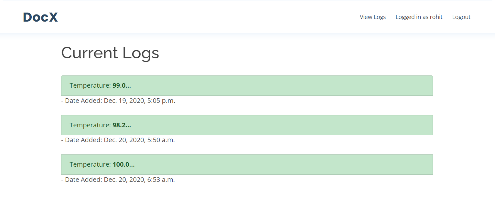
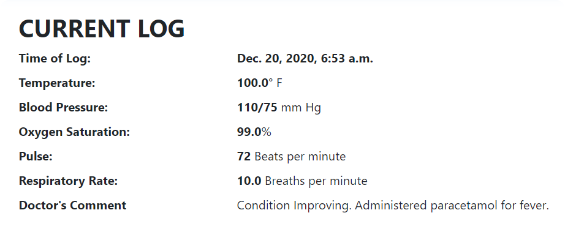
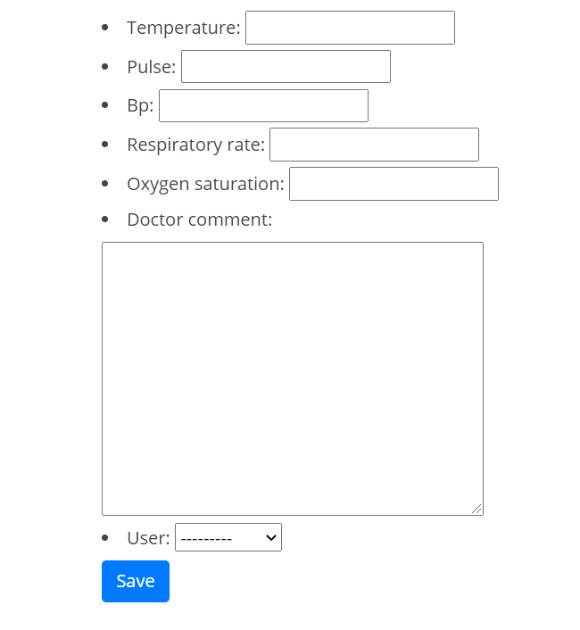

# DocX - HackUMass


DocX is an all in one solution to track your loved ones from any hospitals 24/7, It provides you transparency and helps you to monitor your loved ones without any 'visiting hours' hurdle!

* **Patient vitals** are **continously** monitored.
* Read the **Doctor's comments** and stay worry free at home.
* **Book Appointments** with doctors virtually.
 * Check **detailed hospital bills** and pay them

<p align="center">
  
</p>

## Inside the Webapp
Login as a patient to view logs updated timely by hospital staff.
<p align="center">
  
</p>

With detailed logs provided as soon as they are updated by the hospital staff, we can forget traditional pen-and-paper logs and embrace technology in the field.

<p align="center">
  
</p>

<p align="center">
  
</p>

Hospitals can accesss their own admin panel and add logs for the patients registered, with detailed information. The form can be editted in the future for adding even more information.

<p align="center">
  
</p>

## How its Built


The project was built using [Django](https://www.djangoproject.com/), which was used to handle
- User Authentication
- Site Navigation
- Database for storing user data

The website was designed using HTML and CSS. We used a bootstrap theme which you can find [here](https://bootstrapmade.com/medilab-free-medical-bootstrap-theme/).

## Run it yourselves

1. Clone/Download the project.

2. Install Django on your system by running the following command in your command line. (Make sure Python is installed: [Link](https://www.python.org/downloads/))
```
pip install django
```

3. Move to the project folder and run the following commands:
```
py manage.py makemigrations
py manage.py migrate
py manage.py runserver
```
4. Now open the following URL on your browser
```
http://127.0.0.1:8000/
```
## Whats coming next?
- Add support for live data reflected from the various equipment at the hospital
- Add bills - So that patients/relatives can check the detailed description for the various daily expenses with full transparency
- Improve the UI of the webapp

---

### Note
This is a project for the ***HackUMass VIII*** Hackathon. 

#### Team Members
- Rohitashwa Pareek
- Shreevardhan Shah

---