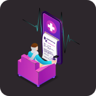

# DocX - HackUMass

DocX is an all in one solution to track your loved ones from any hospitals 24/7, It provides you transparency and helps you to monitor your loved ones without any 'visiting hours' hurdle!

* **Patient vitals** are **continously** monitored.
* Read the **Doctor's comments** and stay worry free at home.
* **Book Appointments** with doctors virtually.
 * Check **detailed hospital bills** and pay them

  

## How it Works
Login as a patient to view logs updated timely by hospital staff.

With detailed logs provided as soon as they are updated by the hospital staff, we can forget traditional pen-and-paper logs and embrace technology in the field.

  

